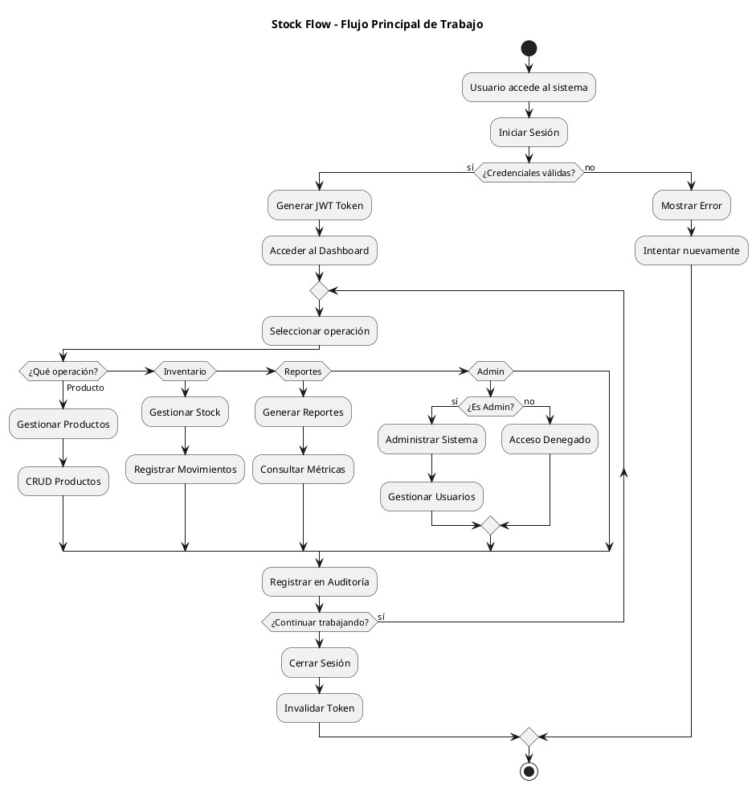

### Casos de Uso Detallados por Módulo

## 1. Módulo de Autenticación y Seguridad

| Caso de Uso | Actor | Descripción | Precondiciones | Postcondiciones |
|-------------|-------|-------------|----------------|-----------------|
| **Iniciar Sesión** | Empleado, Admin | Usuario ingresa credenciales válidas, sistema genera JWT token | Usuario registrado y activo | Sesión iniciada, token válido |
| **Cerrar Sesión** | Empleado, Admin | Usuario termina sesión, sistema invalida token | Sesión activa | Token invalidado, sesión cerrada |
| **Cambiar Contraseña** | Empleado, Admin | Usuario actualiza su contraseña personal | Sesión activa, contraseña actual válida | Contraseña actualizada |
| **Gestionar Sesiones** | Empleado, Admin | Ver y controlar sesiones activas del usuario | Sesión activa | Control de sesiones concurrentes |
| **Recuperar Contraseña** | Admin | Resetear contraseña de cualquier usuario | Usuario existe en sistema | Nueva contraseña temporal |

## 2. Módulo de Gestión de Productos

| Caso de Uso | Actor | Descripción | Precondiciones | Postcondiciones |
|-------------|-------|-------------|----------------|-----------------|
| **Crear Producto** | Empleado, Admin | Registrar nuevo producto con código único | Categoría y proveedor existen | Producto creado con stock inicial |
| **Consultar Productos** | Empleado, Admin | Buscar y visualizar información de productos | - | Lista de productos filtrada |
| **Actualizar Producto** | Empleado, Admin | Modificar datos de producto existente | Producto existe | Producto actualizado, cambios auditados |
| **Desactivar Producto** | Admin | Marcar producto como inactivo | Producto existe y activo | Producto inactivo, no disponible para nuevas transacciones |
| **Buscar por Código** | Empleado, Admin | Localizar producto por SKU o código de barras | - | Producto encontrado o mensaje de no encontrado |

## 3. Módulo de Control de Inventario

| Caso de Uso | Actor | Descripción | Precondiciones | Postcondiciones |
|-------------|-------|-------------|----------------|-----------------|
| **Registrar Entrada** | Empleado, Admin | Registrar ingreso de mercancía al inventario | Producto existe | Stock incrementado, movimiento registrado |
| **Registrar Salida** | Empleado, Admin | Registrar salida de productos del inventario | Stock disponible suficiente | Stock decrementado, movimiento registrado |
| **Ajustar Stock** | Empleado, Admin | Corregir diferencias entre stock físico y sistema | Justificación del ajuste | Stock corregido, ajuste auditado |
| **Consultar Stock** | Empleado, Admin | Ver niveles actuales de inventario | - | Información de stock en tiempo real |
| **Reservar Stock** | Empleado, Admin | Apartar productos para pedidos específicos | Stock disponible | Cantidad reservada, disponible reducido |
| **Transferir Stock** | Empleado, Admin | Mover productos entre ubicaciones | Stock origen suficiente | Stock transferido entre ubicaciones |

## 4. Módulo de Reportes y Análisis

| Caso de Uso | Actor | Descripción | Precondiciones | Postcondiciones |
|-------------|-------|-------------|----------------|-----------------|
| **Generar Reporte Stock** | Empleado, Admin | Crear reporte de inventario actual | - | Archivo de reporte generado |
| **Generar Reporte Movimientos** | Empleado, Admin | Exportar historial de transacciones | - | Reporte de movimientos por período |
| **Consultar Dashboard** | Empleado, Admin | Ver métricas y KPIs en tiempo real | Sesión activa | Dashboard con métricas actualizadas |
| **Programar Reportes** | Admin | Configurar generación automática de reportes | Plantilla de reporte definida | Reporte programado, envío automático |
| **Analizar Tendencias** | Admin | Revisar patrones de consumo y stock | Datos históricos disponibles | Análisis predictivo generado |

## 5. Módulo de Administración

| Caso de Uso | Actor | Descripción | Precondiciones | Postcondiciones |
|-------------|-------|-------------|----------------|-----------------|
| **Gestionar Usuarios** | Admin | CRUD de empleados del sistema | Permisos de administrador | Usuario creado/modificado/desactivado |
| **Configurar Roles** | Admin | Definir roles y permisos del sistema | - | Roles y permisos configurados |
| **Consultar Auditoría** | Admin | Revisar logs de todas las acciones | - | Historial de auditoría visualizado |
| **Configurar Sistema** | Admin | Ajustar parámetros y políticas | - | Configuración del sistema actualizada |
| **Realizar Backup** | Admin | Generar copia de seguridad de datos | - | Backup creado y verificado |

## 6. Operaciones Móviles (PWA)

| Caso de Uso | Actor | Descripción | Precondiciones | Postcondiciones |
|-------------|-------|-------------|----------------|-----------------|
| **Escanear Código** | Empleado, Admin | Usar cámara para leer códigos de barras | Dispositivo con cámara | Producto identificado |
| **Movimiento Rápido** | Empleado, Admin | Registrar transacciones desde móvil | Conexión a internet | Movimiento registrado en tiempo real |
| **Consulta Móvil** | Empleado, Admin | Ver stock desde dispositivo móvil | - | Información de stock accesible |

### Flujos de Trabajo Principales

### Validaciones y Reglas de Negocio

**Reglas de Autenticación:**
- Máximo 3 intentos de login fallidos
- Tokens JWT con expiración de 8 horas
- Máximo 5 sesiones concurrentes por usuario

**Reglas de Inventario:**
- No permitir stock negativo
- Alertas automáticas cuando stock < mínimo
- Movimientos requieren justificación
- Stock reservado no puede exceder disponible

**Reglas de Productos:**
- Códigos SKU únicos obligatorios
- Precios deben ser mayores a cero
- Productos inactivos no permiten nuevos movimientos
- Categoría y proveedor obligatorios

**Reglas de Seguridad:**
- Empleados no pueden eliminar registros
- Administradores pueden reversar movimientos (con auditoría)
- Todas las acciones críticas se auditan
- Acceso basado en roles estricto
